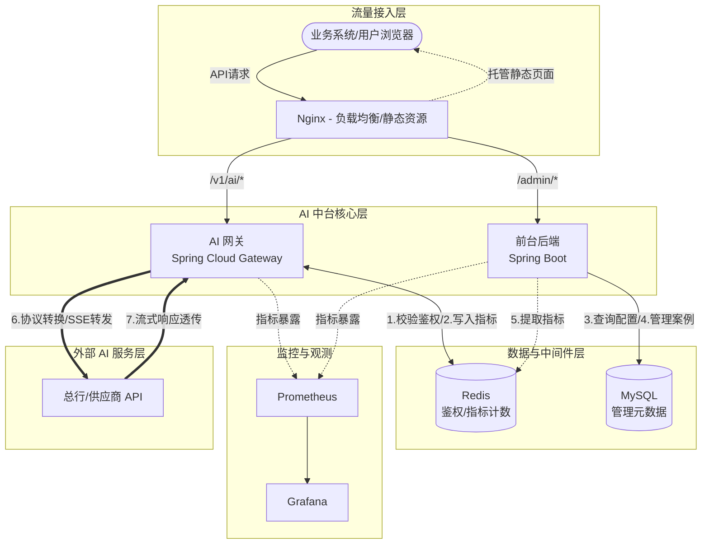

# AI 中台 (AI-Portal) 技术架构文档

## 1. 整体架构图 (Mermaid)

## 2. 核心组件说明

### 2.1 技术栈版本概览 (Stack Versions)
- **Java SDK**: 17 (Amazon Corretto 或 Oracle LTS)
- **Spring Boot**: 3.2.11
- **Spring Cloud**: 2023.0.3 (Leyton SR3)
- **构建工具**: Maven 3.8+
- **响应式编程**: Project Reactor / Spring WebFlux (仅用于 Gateway)

### 2.2 AI 网关 (ai-portal-gateway)
- **核心框架**: Spring Cloud Gateway
- **通讯方式**: 基于 Netty 的异步非阻塞 IO
- **鉴权存储**: Spring Data Reactive Redis (使用 Lettuce 驱动)
- **职责**: 
  - **协议转换**: 将内部自研 JSON 协议映射为外部供应商所需的参数格式。
  - **鉴权**: 拦截所有请求，从 Header 中提取 `X-API-Key`，通过 Redis 校验合法性。
  - **流式转发 (SSE)**: 利用 WebFlux 的响应式编程特性，实现 HTTP SSE 的长连接透明转发。
- **性能目标**: 纯内存操作 + 异步 IO，确保 Overhead < 100ms。

### 2.3 前台后端 (ai-portal-admin)
- **核心框架**: Spring Boot 3.2.x, Spring Web (Servlet 模式)
- **持久层**: MyBatis 3.0.x (Spring Boot Starter)
- **数据库驱动**: MySQL Connector/J 8.x
- **职责**:
  - 提供能力地图（卡片数据）、应用案例分享的 CRUD 接口。
  - 汇总 Redis 中的实时监控指标（TPS、延迟、可用率）。
  - 提供 API 文档展示所需的元数据。

### 2.4 前台 UI (ai-portal-ui)
- **核心框架**: React 18
- **组件库**: Ant Design 5.x (采用 CSS-in-JS，性能更优)
- **状态管理**: TanStack Query (React Query) 或 Zustand
- **职责**:
  - **监控看板**: 定时轮询展示实时指标。
  - **能力地图**: 卡片化展示，支持分类筛选和详情 Modal 弹出。

## 3. 中间件与数据存储

| 中件间/数据库        | 用途                                 | 选择理由                             |
|:-------------- |:---------------------------------- |:-------------------------------- |
| **Redis**      | API Key 缓存、实时监控指标计数（AtomicCounter） | 高并发下的极低延迟，适合 100 TPS 的鉴权与计数场景。   |
| **MySQL**      | 存储能力地图定义、应用案例、API Key 元数据          | 成熟稳定，适合存储结构化管理数据。                |
| **Prometheus** | (可选) 指标采集                          | Spring Cloud 生态适配良好，方便扩展更多维度的监控。 |

## 4. 关键流程设计

### 4.1 AI 请求处理流 (SSE)

1. 业务系统发起 `POST /v1/ai/chat` 请求，Header 包含 `X-API-Key`。
2. 网关 `AuthFilter` 拦截请求，异步查询 Redis 校验 Key 状态。
3. 网关 `ProtocolFilter` 解析 Body，根据配置转换为目标模型 API 格式。
4. 网关使用 `WebClient` 发起异步请求。
5. 若外部返回 `text/event-stream`，网关保持连接，将 Chunk 实时推送到业务系统。
6. 请求结束，记录响应耗时并更新 Redis 中的延迟统计指标。

### 4.2 监控指标统计

- **TPS**: 每次请求进入网关时，Redis 执行 `INCRBY portal:metrics:tps:{timestamp}`，前台后端计算 1 秒内或 1 分钟内的均值。
- **延迟**: 计算 `System.currentTimeMillis()` 的差值，记录到 Redis 的滑动窗口或简单累加。
- **可用率**: 统计 HTTP 2xx 与 5xx 的比例。

## 5. 部署架构

- **方式**: 建议容器化部署或直接运行 JAR 包。
- **扩展性**: 网关与前台后端均为无状态设计，支持通过增加实例数量进行水平扩展。
- **入口控制**: 生产环境建议在网关前置 Nginx 或 SLB，负责 SSL 卸载和基础防护。
